# NFT Marketplace Architecture

## Frontend to Edge Functions to Database Flow

```mermaid
flowchart TD
    subgraph Frontend["🖥️ Frontend Apps"]
        WebApp["Web App"]
        MobileApp["Mobile App"]
    end

    subgraph EdgeFunctions["⚡ Supabase Edge Functions"]
        CreateOffer["create-offer"]
        ListSell["list-sell"]
        CheckStatus["check-offer-status"]
        XummWebhook["xumm-webhook"]
        CreateNFT["create-nft"]
        XummSignin["xumm-signin"]
    end

    subgraph Database["🗄️ Database Layer"]
        NFTOffers["nft_offers table"]
        AuthUsers["auth.users table"]
    end

    subgraph External["🌐 External Services"]
        XummAPI["XUMM API"]
        XRPLNetwork["XRPL Network"]
    end

    %% Frontend to Functions
    WebApp --> CreateOffer
    WebApp --> ListSell
    WebApp --> CheckStatus
    WebApp --> CreateNFT
    WebApp --> XummSignin

    MobileApp --> CreateOffer
    MobileApp --> ListSell
    MobileApp --> CheckStatus
    MobileApp --> XummSignin

    %% Functions to Database
    CreateOffer --> NFTOffers
    ListSell --> NFTOffers
    CheckStatus --> NFTOffers
    XummWebhook --> NFTOffers
    XummSignin --> AuthUsers

    %% Functions to External APIs
    CreateOffer --> XummAPI
    CheckStatus --> XummAPI
    XummSignin --> XummAPI
    CreateNFT --> XRPLNetwork

    %% External to Functions (Webhooks)
    XummAPI -.-> XummWebhook

    %% Styling
    classDef frontendStyle fill:#e1f5fe,stroke:#0277bd,stroke-width:2px
    classDef functionStyle fill:#f3e5f5,stroke:#7b1fa2,stroke-width:2px
    classDef dbStyle fill:#e8f5e8,stroke:#2e7d32,stroke-width:2px
    classDef externalStyle fill:#fff3e0,stroke:#ef6c00,stroke-width:2px

    class WebApp,MobileApp frontendStyle
    class CreateOffer,ListSell,CheckStatus,XummWebhook,CreateNFT,XummSignin functionStyle
    class NFTOffers,AuthUsers dbStyle
    class XummAPI,XRPLNetwork externalStyle
```



## Detailed Function Connections

### Frontend → Edge Functions

| Frontend Action        | HTTP Method               | Edge Function        | Purpose                      |
| ---------------------- | ------------------------- | -------------------- | ---------------------------- |
| **Create NFT Offer**   | `POST /create-offer`      | `create-offer`       | User creates sell/buy offer  |
| **Browse Marketplace** | `GET /list-sell`          | `list-sell`          | Show available NFTs for sale |
| **Check Offer Status** | `GET /check-offer-status` | `check-offer-status` | Poll transaction status      |
| **Mint NFT**           | `POST /create-nft`        | `create-nft`         | Create new NFT on XRPL       |
| **Sign In**            | `POST /xumm-signin`       | `xumm-signin`        | Wallet authentication        |
| **Webhook**            | `POST /xumm-webhook`      | `xumm-webhook`       | XUMM status updates          |

### Edge Functions → Database

| Edge Function          | Database Operations                               | Tables Used  |
| ---------------------- | ------------------------------------------------- | ------------ |
| **create-offer**       | ✅ INSERT offer<br>✅ SELECT existing offers      | `nft_offers` |
| **list-sell**          | ✅ SELECT with filters<br>✅ COUNT for pagination | `nft_offers` |
| **check-offer-status** | ✅ SELECT by payload_id<br>✅ UPDATE status       | `nft_offers` |
| **xumm-webhook**       | ✅ UPDATE offer status<br>✅ INSERT tx_hash       | `nft_offers` |
| **create-nft**         | ❌ No direct DB access                            | None         |
| **xumm-signin**        | ✅ INSERT/UPDATE user                             | `auth.users` |

## API Endpoints Summary

### User-Facing Endpoints (Frontend Calls)

```
POST   /functions/v1/create-offer      → Creates NFT offers
GET    /functions/v1/list-sell         → Browse marketplace
GET    /functions/v1/check-offer-status → Poll transaction status
POST   /functions/v1/create-nft        → Mint new NFTs
POST   /functions/v1/xumm-signin       → Wallet authentication
```

### System Endpoints (External Calls)

```
POST   /functions/v1/xumm-webhook      → XUMM status notifications
```

## Database Access Patterns

### Functions that READ from Database:

- **list-sell**: Queries offers with filters (user, NFT, status)
- **check-offer-status**: Finds offers by payload_id or offer_id
- **create-offer**: Validates existing offers (anti-duplicate)

### Functions that WRITE to Database:

- **create-offer**: Stores new offers with pending status
- **check-offer-status**: Updates offer status after XUMM sync
- **xumm-webhook**: Updates offer status from webhook events
- **xumm-signin**: Manages user authentication records

### Functions with NO Database Access:

- **create-nft**: Only interacts with XRPL network directly

## External Service Connections

### XUMM API Integration:

- **create-offer**: Creates payment payloads
- **check-offer-status**: Queries payload status
- **xumm-signin**: Handles authentication
- **xumm-webhook**: Receives status updates

### XRPL Network Integration:

- **create-nft**: Mints NFTs on XRPL
- **create-offer**: Validates NFT ownership for buy offers

This architecture ensures clean separation of concerns with the service layer handling business logic and the repository layer managing all database operations.
