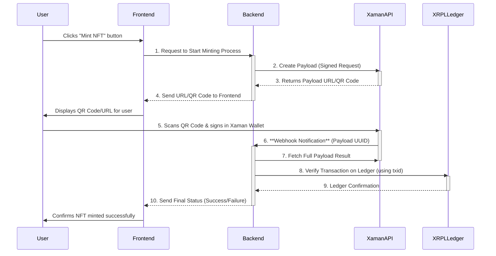

Flow

```mermaid
sequenceDiagram
    participant User
    participant Frontend
    participant Backend
    participant XamanAPI
    participant XRPLLedger

    User->>Frontend: Clicks "Mint NFT" button
    Frontend->>Backend: 1. Request to Start Minting Process
    activate Backend
    Backend->>XamanAPI: 2. Create Payload (Signed Request)
    activate XamanAPI
    XamanAPI-->>Backend: 3. Returns Payload URL/QR Code
    deactivate XamanAPI
    Backend-->>Frontend: 4. Send URL/QR Code to Frontend
    deactivate Backend

    Frontend->>User: Displays QR Code/URL for user
    User->>XamanAPI: 5. Scans QR Code & signs in Xaman Wallet
    activate XamanAPI
    XamanAPI->>Backend: 6. **Webhook Notification** (Payload UUID)
    activate Backend
    Backend->>XamanAPI: 7. Fetch Full Payload Result
    deactivate XamanAPI
    Backend->>XRPLLedger: 8. Verify Transaction on Ledger (using txid)
    activate XRPLLedger
    XRPLLedger-->>Backend: 9. Ledger Confirmation
    deactivate XRPLLedger

    Backend-->>Frontend: 10. Send Final Status (Success/Failure)
    deactivate Backend
    Frontend->>User: Confirms NFT minted successfully
```
