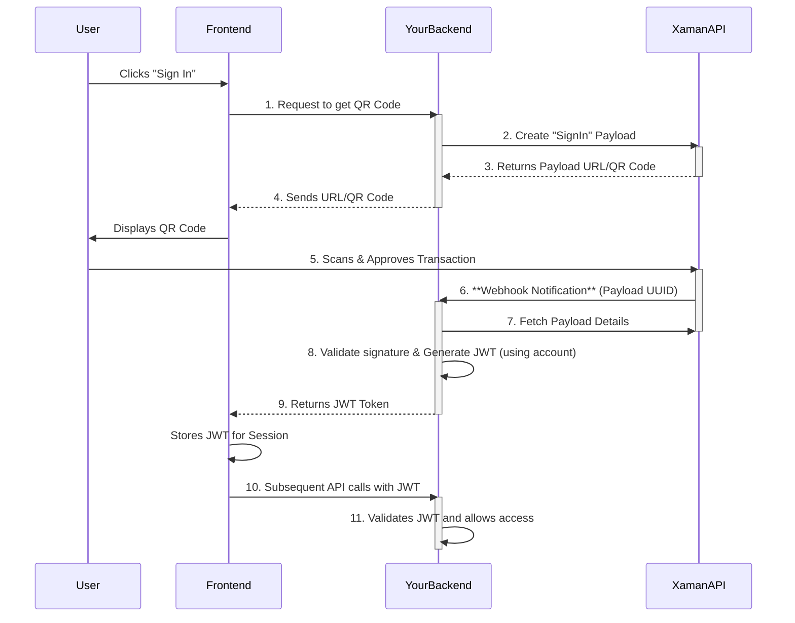

flow

```mermaid
sequenceDiagram
    participant User
    participant Frontend
    participant YourBackend
    participant XamanAPI

    User->>Frontend: Clicks "Sign In"
    Frontend->>YourBackend: 1. Request to get QR Code
    activate YourBackend
    YourBackend->>XamanAPI: 2. Create "SignIn" Payload
    activate XamanAPI
    XamanAPI-->>YourBackend: 3. Returns Payload URL/QR Code
    deactivate XamanAPI
    YourBackend-->>Frontend: 4. Sends URL/QR Code
    deactivate YourBackend

    Frontend->>User: Displays QR Code
    User->>XamanAPI: 5. Scans & Approves Transaction
    activate XamanAPI
    XamanAPI->>YourBackend: 6. **Webhook Notification** (Payload UUID)
    activate YourBackend
    YourBackend->>XamanAPI: 7. Fetch Payload Details
    deactivate XamanAPI
    YourBackend->>YourBackend: 8. Validate signature & Generate JWT (using account)
    YourBackend-->>Frontend: 9. Returns JWT Token
    deactivate YourBackend
    Frontend->>Frontend: Stores JWT for Session
    Frontend->>YourBackend: 10. Subsequent API calls with JWT
    activate YourBackend
    YourBackend->>YourBackend: 11. Validates JWT and allows access
    deactivate YourBackend
```
