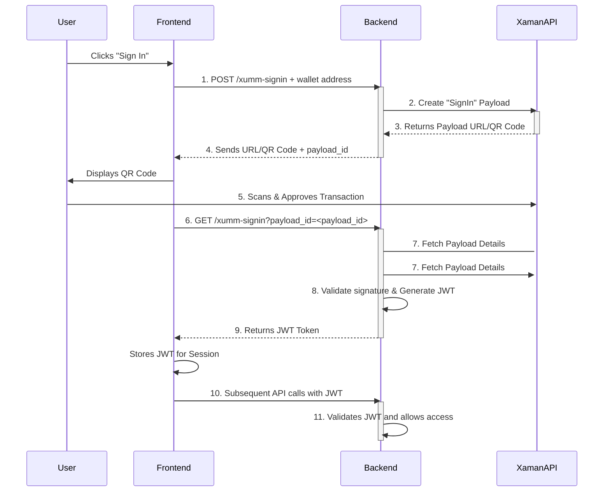

flow



## Endpoints & Implementation Notes

- Create sign-in payload (frontend -> backend)

  - Endpoint: `POST /xumm-signin`
  - Body: `{ "wallet_address": "rp..." }` (optional depending on your flow)
  - Response: `SignInResponse` containing `payload_id`, `qr_code`, `deep_link`, and `next_step`.
  - Frontend behavior: display QR / deep link and keep `payload_id` locally to poll or subscribe for updates.

- Check sign-in status (frontend -> backend)

  - Endpoint: `GET /xumm-signin?payload_id=<UUID>`
  - Response: `SignInStatusResponse` containing `signed`, `status` (pending|resolved), and when available `user_token`, `wallet_address` and optionally `jwt` (see note below).
  - Recommended behavior: first check the backend for a stored resolved record (fast). If no record, the backend may fetch XUMM payload status as a fallback.

- XUMM webhook (XUMM -> backend)
  - Endpoint: `POST /xumm-webhook` (or the URL you configured in XUMM)
  - Payload: XUMM will notify with the payload UUID. Do not trust the incoming body alone — call Xumm API server-side to fetch payload details.
  - Server action: call `XummService.getPayloadStatus(payloadId)`. If `signed === true` and `wallet_address` is present, mark the sign-in resolved and persist the payload metadata (see below). Optionally generate a JWT for the session or defer JWT creation until the frontend requests it.

### Supabase Realtime / What to store

- To enable realtime notifications to the browser using Supabase Realtime, the webhook handler must write to Postgres (Supabase) so the realtime engine can emit change events.
- Minimal recommended row to persist (table `xumm_signins`):

  - `payload_id` (text PRIMARY KEY)
  - `wallet_address` (text)
  - `user_token` (text, nullable) — XUMM user push token if available
  - `status` (text) — `pending` | `resolved` | `expired` | `cancelled`
  - `expires_at` (timestamptz, nullable)
  - `created_at` (timestamptz DEFAULT now())

- On webhook resolved: upsert the row with `status = 'resolved'` and `wallet_address` and `user_token`. Supabase Realtime clients subscribed to that row will receive an `UPDATE` event and can then call `GET /xumm-signin?payload_id=...` to retrieve/generate a JWT.

### JWT storage recommendation

- You do not strictly need to store the JWT in the database. Two common approaches:
  1. Store session JWT in DB (convenient): webhook handler generates JWT and upserts it. GET simply returns it. Be mindful of security; restrict table access and consider encrypting or hashing tokens.
  2. Preferable for rotation/safety: store only payload metadata (`wallet_address`, `user_token`, `status`) and generate a short-lived JWT on-demand when GET `/xumm-signin` is called. This avoids persisting signed tokens and simplifies rotation.

### Frontend realtime subscription example (Supabase JS)

```js
const channel = supabase
  .channel('xumm-signin')
  .on('postgres_changes', { event: 'UPDATE', schema: 'public', table: 'xumm_signins', filter: `payload_id=eq.${payloadId}` }, (payload) => {
    const record = payload.record;
    if (record?.status === 'resolved') {
      // Option A: receive JWT directly in record.jwt (if you chose to store it)
      // Option B (recommended): call GET /xumm-signin?payload_id=... to get the JWT
      fetch(`/xumm-signin?payload_id=${payloadId}`).then(...);
      channel.unsubscribe();
    }
  })
  .subscribe();
```

### Security notes

- Always fetch payload details from XUMM server-side using your `XUMM_API_KEY` and `XUMM_API_SECRET` rather than trusting the webhook body.
- If XUMM provides webhook signature verification, implement that check.
- Keep `JWT_SECRET` in environment and never commit it.

### Quick Setup

- Set `JWT_SECRET` in your Supabase function environment (e.g. in `supabase/.env` when running locally).
- The `AuthService` (in `_shared/auth/service.ts`) generates short-lived JWTs for sign-in sessions. Default TTL is 1 hour; `xumm-signin` returns a 15-minute JWT by default.

Example `.env` entry:

```
JWT_SECRET=your-very-secret-value
```
